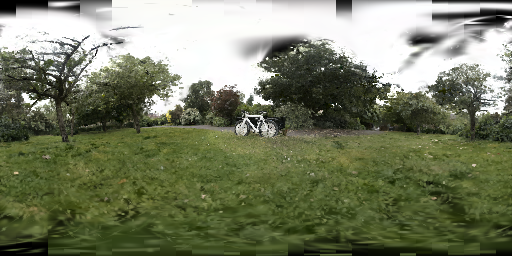
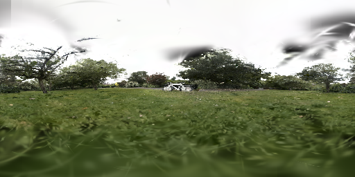

# GS2Pano

> Fast convert 3D Gaussian Splatting scenes to 360° panoramas + per-pixel GS-ray pairing datasets for downstream training.

<p align="center">
  <br>
  <sub>3D Gaussian Splatting scene (bicycle, MipNerf360)</sub>
</p>

<p align="center"><b>↓ spherical projection + frustum rendering ↓</b></p>

<table>
<tr>
<td align="center"><b>Equirectangular</b><br></td>
<td align="center"><b>Mercator</b><br></td>
</tr>
</table>

Given a `.ply` file and a camera pose, GS2Pano renders an equirectangular or Mercator panorama and produces a `.npz` dataset pairing every pixel with the Gaussians that intersect its frustum cone.

---

## Installation

```bash
# 1. Create environment
conda create -n gs2pano python=3.10 -y
conda activate gs2pano

# 2. Install PyTorch (adjust CUDA version as needed)
pip install torch==2.4.0 torchvision==0.19.0 --index-url https://download.pytorch.org/whl/cu124

# 3. Install dependencies
pip install 'setuptools<82' ninja numpy jaxtyping rich plyfile Pillow scipy numba

# 4. Extract gsplat (compressed to reduce repo size)
#    The submodules/gsplat directory is shipped as gsplat.tar.gz.
#    Extract it once before the first build:
cd submodules
tar -xzf gsplat.tar.gz
cd ..

# 5. Build gsplat from source (includes GS2Pano CUDA patches)
cd submodules/gsplat
CUDA_HOME=/usr/local/cuda-12.4 \
  BUILD_3DGUT=1 \
  NVCC_FLAGS="-allow-unsupported-compiler" \
  CC=/usr/bin/gcc CXX=/usr/bin/g++ \
  pip install --no-build-isolation -e .
cd ../..
```

> Adjust `CUDA_HOME`, `CC`, `CXX`, and `NVCC_FLAGS` to match your system.
> If you modify any `.cu` / `.h` source files inside `submodules/gsplat`, re-run step 5.

---

## Quick Start

All scripts use a **CONFIG block at the top** — edit the paths, then run.

### Render a panorama

```python
# scripts/render_pano.py
PLY_PATH  = "path/to/point_cloud.ply"
JSON_PATH = "path/to/cameras.json"
CAM_ID    = 0
```
```bash
python scripts/render_pano.py
# → panorama_{name}_{W}x{H}_{proj}.png
```

### Generate paired dataset

```python
# scripts/render_and_pair.py
PLY_PATH  = "path/to/point_cloud.ply"
JSON_PATH = "path/to/cameras.json"
CAM_ID    = 0
GEN_PLY   = True     # also output a reconstructed PLY
```
```bash
python scripts/render_and_pair.py
# → panorama_{name}_{W}x{H}_{proj}.png
# → panorama_{name}_{W}x{H}_{proj}.npz   (paired dataset)
# → panorama_{name}_{W}x{H}_{proj}.ply   (if GEN_PLY=True)
```

### Reconstruct PLY from dataset

```bash
python scripts/recon_3dgs_ply.py \
  --npz output/panorama_xxx.npz \
  --ply path/to/original.ply \
  --out reconstructed.ply
```

Outputs a binary PLY viewable in SuperSplat with all Gaussians referenced in the dataset.

### Additional examples

**Multi-camera rendering (CLI):**

```bash
python scripts/render_panorama.py \
  --ply path/to/point_cloud.ply \
  --camera-json path/to/cameras.json \
  --cameras 0,5,10 \
  --width 1024 --height 512 \
  --projection mercator \
  --outdir output
```

**Batch process all MipNerf360 scenes:**

```python
# scripts/batch_mipnerf360.py
SRC_DIR = "path/to/MipNerf360"
OUT_DIR = "path/to/output"
```
```bash
python scripts/batch_mipnerf360.py
```

Processes all 9 scenes with the first camera. Outputs `.png`, `.npz`, and a `config.json` summary.

---

## Input Formats

### PLY file

Standard 3DGS `.ply` with: `x, y, z, nx, ny, nz, f_dc_0-2, f_rest_0-44, opacity, scale_0-2, rot_0-3`.

Opacity is auto-detected — if `max(opacity) > 1.0` the script applies sigmoid activation.

### Camera pose

| Mode | Source | Config fields |
|------|--------|---------------|
| `json` | `cameras.json` (MipNerf360 format) | `JSON_PATH` + `CAM_ID` |
| `colmap` | COLMAP `sparse/` directory | `COLMAP_DIR` + `CAM_ID` |
| `direct` | Manual values | `DIRECT_POS` + `DIRECT_R` |

---

## NPZ Dataset Format

Sorted by `(pixel_id, hit_t)` — same-pixel rows contiguous, GS within a pixel front-to-back.

| Field | Shape | Description |
|-------|-------|-------------|
| `pix_id` | `[M]` int32 | Pixel linear index, sorted ascending |
| `gid` | `[M]` int32 | Index into the original PLY |
| `hit_t` | `[M]` float32 | Distance along best-case frustum ray |
| `opac` | `[M]` float32 | GS opacity (after sigmoid) |
| `alpha` | `[M]` float32 | Local alpha under frustum evaluation |
| `T` | `[M]` float32 | Transmittance (>0 visible, 0 occluded) |
| `xyz` | `[M,3]` float32 | GS world-space position |
| `rgb` | `[M,3]` float32 | GS colour (SH DC) |
| `scale` | `[M,3]` float32 | GS scales (exp-activated) |
| `quat` | `[M,4]` float32 | GS quaternion (w,x,y,z) |
| `pixel_starts` | `[H*W+1]` int64 | CSR offsets for per-pixel access |
| `pixel_bounds` | `[H*W,4]` float32 | Frustum bounds `(θ_min,θ_max,φ_min,φ_max)` |
| `cam_pos` | `[3]` float32 | Camera world position |
| `W`, `H` | int | Panorama resolution |
| `N_gauss` | int | Total GS in the scene |

**Access all GS for pixel `pid` in one line:**

```python
data = np.load("scene.npz")
s, e = data["pixel_starts"][pid], data["pixel_starts"][pid+1]
gs = {k: data[k][s:e] for k in ["gid","xyz","rgb","scale","quat","hit_t","alpha","T"]}
```

---

## Rendering Pipeline

```
Phase 1: Spherical projection (CPU, ~0.2 s)
  Project each GS to equirectangular / Mercator pixel coords + radius

Phase 2: Tile assignment (CUDA, ~0.01 s)
  Ellipse-bbox intersection, GS sorted front-to-back per tile

Phase 3: Frustum evaluation + pair collection (CUDA, ~0.15 s)
  For each pixel, find the frustum ray closest to the GS centre.
  3DGUT evaluation → hit_t, d², alpha, T.
  Render pixel colour via front-to-back α-blending.
  Write paired data via __device__ global pointer (ctypes, zero signature change).
```

## GS Filtering

| Stage | Condition | Purpose |
|-------|-----------|---------|
| Tile | Ellipse bbox ∩ tile | Coarse spatial culling |
| **Record** | `hit_t ≥ 1e⁻⁶` AND `d² < 8.97` AND `α ≥ 1/255` | Any frustum ray hits GS |
| **Render** | Same as record + `next_T > 1e⁻⁴` | α-blend until opaque |

- **Visible GS**: `T > 0` — contributed to pixel colour.
- **Occluded GS**: `T = 0` — in frustum, but behind the surface.

---

## Performance

MipNerf360, 1024×512 Mercator, frustum method, NVIDIA RTX 3090:

| Scene | GS | Pairs | Vis. | Unique GS | Render | Total |
|-------|-----|-------|------|-----------|--------|-------|
| bicycle | 1.55M | 15.5M | 62.5% | 100% | 0.24s | 15.4s |
| bonsai | 0.85M | 15.0M | 63.2% | 99.8% | 0.04s | 13.9s |
| counter | 0.47M | 14.3M | 65.2% | 100% | 0.02s | 11.7s |
| flowers | 1.14M | 10.2M | 52.1% | 100% | 0.03s | 10.4s |
| garden | 2.64M | 14.2M | 45.4% | 100% | 0.06s | 16.5s |
| kitchen | 1.18M | 9.9M | 51.6% | 100% | 0.09s | 10.2s |
| room | 0.57M | 19.9M | 68.1% | 99.9% | 0.02s | 15.9s |
| stump | 1.06M | 11.0M | 59.2% | 100% | 0.04s | 10.9s |
| treehill | 1.01M | 15.2M | 66.2% | 100% | 0.03s | 13.8s |
| **Total** | **11.6M** | **125M** | **60.2%** | **100%** | **0.6s** | **119s** |

---

## Project Structure

```
GS2Pano/
├── README.md
├── AGENTS.md
├── scripts/
│   ├── render_pano.py                 # Render panorama only
│   ├── render_and_pair.py             # Render + paired dataset
│   ├── recon_3dgs_ply.py              # npz → PLY converter
│   └── batch_mipnerf360.py            # Batch MipNerf360 processing
├── gs2pano/
│   ├── load/                          # PLY + pose loading
│   ├── render/                        # Projection, rays, CUDA engine
│   └── output/                        # Numba-accelerated pairing (alt. path)
└── submodules/gsplat/                 # gsplat with GS2Pano patches
```
